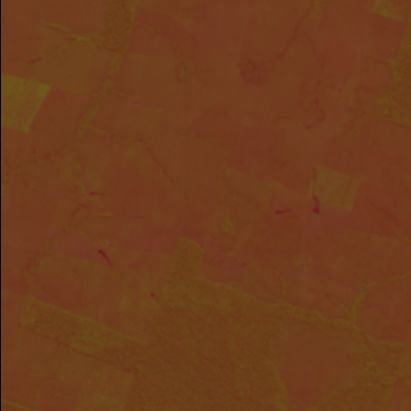
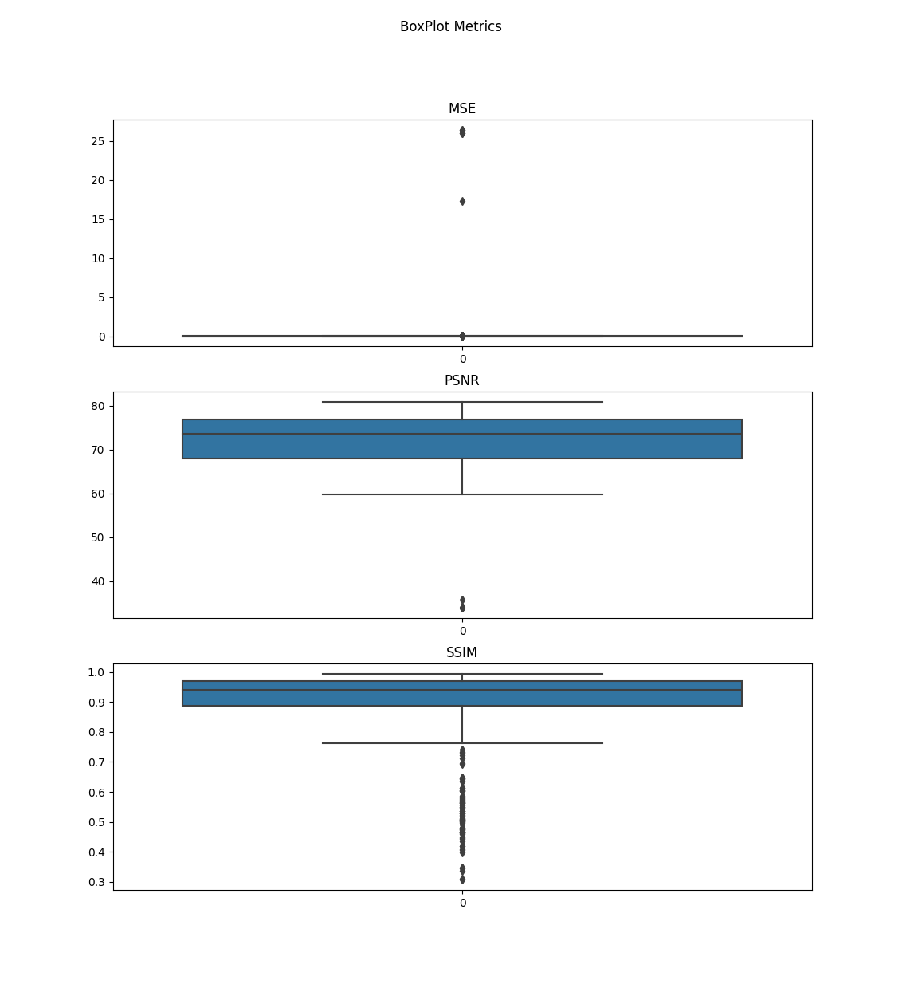

# Cloud Painting: Recuperação de Regiões Cobertas por Nuvens

[](https://opensource.org/licenses/MIT)
[](https://github.com/emilibezerra/cloud_painting/graphs/contributors)

Bem-vindo ao repositório Cloud Painting! Aqui você encontrará um projeto relacionado à recuperação de regiões cobertas por nuvens em imagens satelitais, utilizando a técnica de inpainting. Este repositório é desenvolvido e mantido por [Emili Bezerra](https://github.com/emilibezerra).

## Sobre

A recuperação de regiões cobertas por nuvens em imagens satelitais é um desafio comum na área de processamento de imagens e visão computacional. A presença de nuvens pode prejudicar a qualidade e a utilidade das imagens, dificultando a análise e a extração de informações. O objetivo do projeto Cloud Painting é desenvolver e disponibilizar um conjunto de algoritmos e ferramentas para realizar a recuperação dessas regiões usando a técnica de inpainting.

## Conteúdo

O repositório Cloud Painting contém o código-fonte e os recursos necessários para a aplicação da técnica de inpainting em imagens satelitais com regiões cobertas por nuvens. Aqui está uma visão geral do conteúdo disponível:

- **data**: Pasta contendo as imagens de entrada com regiões cobertas por nuvens.
- **src**: Pasta contendo o código-fonte do projeto.

```
project/
|-- data/
|   |-- clipped_dataset/       [contain all images with 3 bands (B4, B5, B10)]
|   |   |-- train/             [contain 80/100 images with 3 bands (B4, B5, B10)]
|   |   |-- test/              [contain 10/100 images with 3 bands (B4, B5, B10)]
|   |   |-- val/               [contain 10/100 images with 3 bands (B4, B5, B10)]
|   |-- LST/                   [images with land surface temperature]
|   |   |-- train/             [contain 80/100 images LST]
|   |   |-- test/              [contain 10/100 images LST]
|   |   |-- val/               [contain 10/100 images LST]
|   |-- NDVI/                  [images with Noramilized Diferencial Vegetation Index]
|   |   |-- train/             [contain 80/100 images NDVI]
|   |   |-- test/              [contain 10/100 images NDVI]
|   |   |-- val/               [contain 10/100 images NDVI]
|   |-- metadata_xml/          [metadata to calculate NDVI and LST of images]
|-- src/
|   |-- combine_bands.py       [combines the images from Bands 4, 5 and 10]
|   |-- preprocess_dataset.py  [rotates the angles of the images and then crops it into images in 256 x 256 format]
|   |-- landsat8.py            [calculates LST and NDVI in a single image with the .json file] 
|   |-- cod2021.py             [calculates the LST and NDVI in the dataset with the .xml file]
|   |-- read_ndvi_lst.py       [makes it possible to read and visualize data]
|   |-- load_mask.py           [overlay images from a dataset with masks]
|   |-- train_test_split.py    [separates data for training (80/100), testing (10/100) and validation (10/100)]
|   |-- evaluation_metrics.py  [metrics for evaluating the original dataset and the one that received treatment. Metrics applied: MSE, PSNR and SSIM]
|-- img/
|   |-- lst_example.png
|   |-- ndvi_example.png
|   |-- metrics_example.png
|-- README.md
|-- requirements.txt


```
## CLIPPED_DATASET

An example:


## NDVI
An example:


## LST
An example:


## LST
An example:



## Uso

Para utilizar o projeto Cloud Painting, siga as instruções abaixo:

Para combinar as bandas que serão trabalhadas use o seguinte script:

```shell
python3 combine_bands.py --dataset PATH_TO_DATASET(B4, B5, B10) --output_dataset PATH_TO_COMBINED_DATASET
```

Para gerar as imagens ajustadas use o seguinte script:

```shell
python3 preprocess_dataset.py --current_dataset PATH_TO_DATASET --extension IMAGE_FORMAT --output_desired OUTPUT_SIZE --ou
tput_dataset PATH_TO_OUTPUT_DATASET

```
Para gerar as máscaras de nuvens artificiais use o seguinte script:

```shell
python3 load_mask.py --image_dataset PATH_TO_DATASET --mask_dataset PATH_TO_MASKS --output_maskDataset OUTPUT_MASKS_DATASET

```

Para gerar os valores do LST e NDVI use o seguinte script:

```shell
python3 cod2021.py --dataset_path PATH_TO_DATASET --xml_path PATH_TO_XML folder with metadata 

```

Para dividir os dados em treinamento, teste e validação use o seguinte script:

```shell
python3 train_test_split.py --dataset_clipped_path PATH_TO_DATASET --dataset_ndvi_path PATH_TO_NDVI --dataset_lst_path PATH_TO_LST

```

Para realizar a leitura e visualização dos dados use o seguinte script:

```shell
python3 read_ndvi_lst.py

```


1. Clone este repositório em sua máquina local.
2. Certifique-se de ter as dependências necessárias instaladas.
3. Coloque as imagens de entrada com regiões cobertas por nuvens na pasta "data".
4. Execute o script principal fornecido na pasta "src" para realizar o pre-processamento para a abordagem inpainting.


## Guidelines


dataset -> img(cortado, deskew, ajusted_size)
dataset -> dataset(deskew, ajusted_size) -> dataset_croped(cortado)

## Contribuição

Contribuições são bem-vindas! Se você deseja colaborar com o projeto, sinta-se à vontade para fazer um fork deste repositório, implementar melhorias e enviar uma solicitação de pull. Certifique-se de seguir as diretrizes de contribuição descritas no arquivo CONTRIBUTING.md.

## Licença

Este repositório está licenciado sob a Licença MIT. Consulte o arquivo LICENSE para obter mais informações.

## Contato

Se você tiver alguma dúvida ou sugestão relacionada a este projeto, sinta-se à vontade para entrar em contato comigo através do meu perfil do GitHub ou do meu endereço de e-mail: [emilisilva23@gmail.com](mailto:emilisilva23@gmail.com).

Espero que você encontre os recursos aqui úteis e interessantes! Obrigado por visitar o repositório Cloud Painting. Divirta-se explorando e experimentando a recuperação de regiões cobertas por nuvens em imagens satelitais!